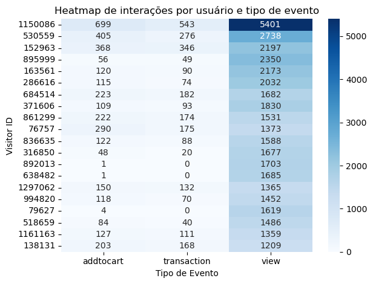
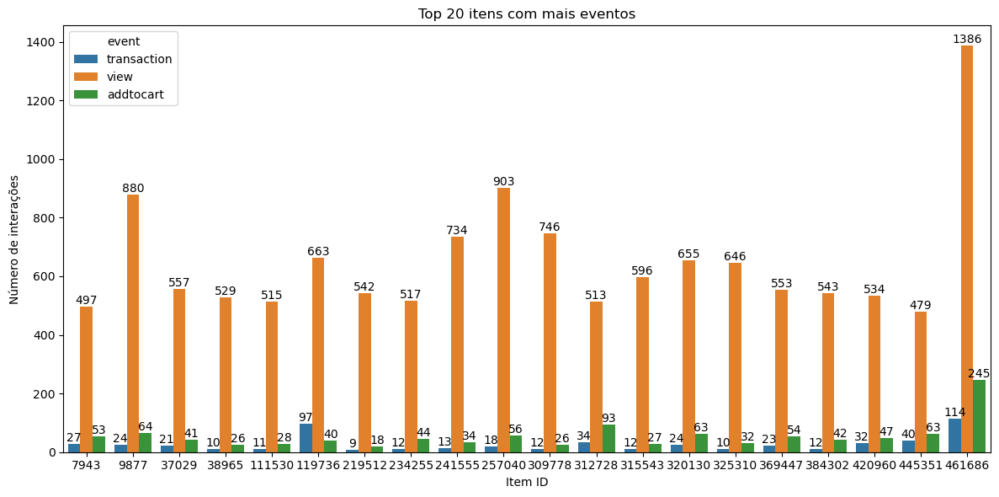
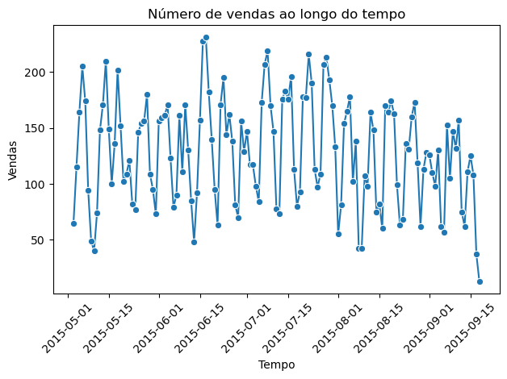
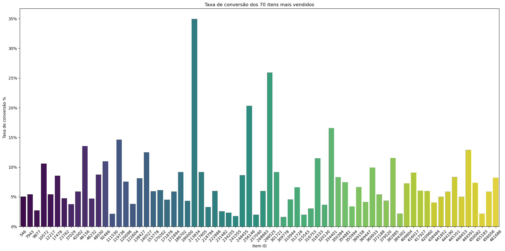

# Recommendation System
## Sistema de recomendação com filtro colaborativo
O projeto foi feito com o objetivo de construir um sistema de recomendação baseado em dados reais. Assim, este projeto implementa um sistema de produtos utilizando o modelo Alternating Least Squares, baseado em dados de interações do e-commerce Retail Rocket. A função desse modelo é recomendar produtos que sejam relevantes para cada usuário com base nas ações realizadas no site, podendo ser visualizações (peso 1), adição ao carrinho (peso 6) e transações (peso 20). 

### Dataset:
- Dataset: Retailrocket recommender system dataset - https://www.kaggle.com/datasets/retailrocket/ecommerce-dataset
- Fonte: Kaggle
#### Tecnologias aplicadas:
- Python
- Bibliotecas: pandas, numpy, matplotlib, seaborn, scipy, implicit
- Jupyter Notebook (exploração inicial)
#### Como rodar localmente:
1. Clone o repositório
2. Crie um ambiente virtual de python
3. Instale as dependências ‘requirements.txt’
4. Certifique-se que os arquivos csv estão no caminho correto
    ├──Recommendation_System/data/raw/events.csv
    ├──Recommendation_System/data/raw/item_properties_part1.csv
    ├──Recommendation_System/data/raw/item_properties_part2.csv
    ├──Recommendation_System/data/raw/category_tree.csv

5. Rode o script principal ‘main.py’
6. Verifique que a saída está de acordo
    - métricas do modelo (Precision@K e NDCG@K) → K =10
    - lista de recomendações para o usuário com ID 54 (ou outro que pode ser especificado)
### Análise exploratória 
- código disponível no jupyter notebook ‘01_exploratory_analysis.ipynb’
Figura 1 - Gráfico de contagem de cada tipo de evento

O gráfico da contagem de cada evento mostra que a maioria dos eventos são visualizações dos itens, em seguida, há adições ao carrinho e, por último, as transações. Esses dados são comuns em e-commerce, mas indicam que os dados são desbalanceados, ou seja, para a recomendação terá que ter um peso consideravelmente diferente para cada ação. Além disso, pode indicar que a maioria dos usuários está apenas navegando pelos produtos, com uma taxa de conversão relativamente baixa.

Figura 2 - Gráfico de HeatMap ente usuários e tipo de evento

O heatmap mostra a quantidade de cada tipo de evento por usuário, foi levado em conta os usuários com a maior soma de eventos. É perceptível que a maioria dos usuários que tem um grande número de visualizações, também apresentam um número maior de transações, havendo poucas exceções.

Figura 3 - 20 principais itens com mais interações

O gráfico mostra que os produtos com mais eventos são aqueles que possuem mais visualizações, seguidos por adições ao carrinho e, por último, as transações. É possível perceber como a distribuição dos eventos é realmente desbalanceada, sendo o item '461686' com mais interações (1745 no total), tendo apenas 114 transações.

Figura 4 - Quantidade de vendas por dia durante o tempo observado

A comparação é feita entre o número de vendas e o tempo (em dias) durante cinco meses, de maio a agosto de 2015. Considerando que dataset do e-commerce é de fora do Brasil, datas importantes para o comércio brasileieiro, como o dia dos namoraods (12 de junho) não tem impacto significativo nas vendas.

Dessa forma, pode-se considerar datas como o dia das mães (11 de maio), que foi perceptível um pico nas vendas nos dias anteriores,com, aproximadamente, 200 vendas no dia 6 de maio.

No entanto, o maior número de vendas ocorreu no dia 16 de junho, com cerca de 230 vendas e o maior declínio se apresentou no dia 18 de setembro, cerca de 13 vendas. 

Figura 5 - Gráfico da taxa de conversão dos 70 itens principais

A taxa de conversão é a porcentagem de visualizações que resultaram em uma transação.

Nesse gráfico foram observadas as taxas de conversão dos 70 itens mais vendidos. Dos quais, a maior taxa de conversão foi de 35% do item ‘21384’, que não aparece no gráfico de itens com mais eventos. Isso ocorre, provavelmente, porque a soma dos eventos nesse item não está entre os maiores, desse modo entende-se que, apesar de ter menos eventos, 35% das visualizações resultaram em vendas.

### Resultados e métricas
Durante a análise do projeto foi observado que existiam muitos dados dos usuários, logo, seria interessante fazer uma filtragem colaborativa. Dessa forma, a principal tarefa foi Top N recomendações com Alternating Least Squares e como métricas de avaliação foram escolhidas a Precision@K e a NDCG@K. Então, foram feitos testes para chegar na melhor configuração d modelo chegando no resultado Factors=512, Regularization=0.3, Iterations=10.
  
Esse modelo foi capaz de ter uma Precision@10 de 22.7%, ou seja, quase 3 itens dos 10 recomendados são relevantes. Esse resultado é ótimo considerando que os dados são bastante desbalanceado e tem uma alta esparsidade. Além disso, um NDCG@10 de 0.1673, o que indica que os itens relevantes aparecem mais proximos do topo das indicações, sendo ótimo para UX.

#### Estrutura do projeto
Recommendation_System/
├── data/
│ └── raw/
├── images/
├── src/
│ ├── init.py
│ ├── analysis.py
│ ├── cleaning.py
│ ├── load.py
│ ├── model.py
├── main.py
├── 01_exploratory_analysis.ipynb
├── recomendacoes_produtos_full_script.py
├── requirements.txt
├── README.md
